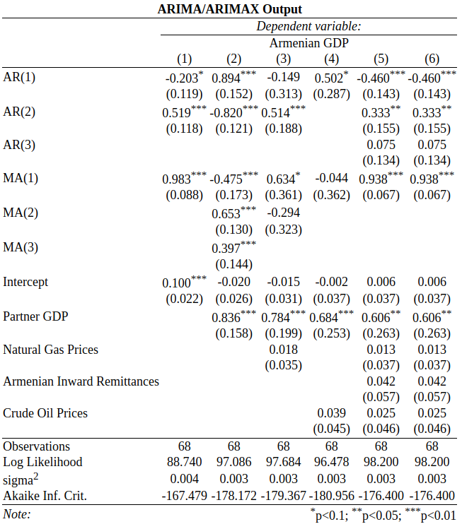

```{r, include=FALSE, results='asis'}
library(readr)
library(readxl)
library(tseries)
library(forecast)
library(reshape)
library(astsa)
library(caschrono)
library(urca)
library(car)
library(knitr)
library(dplyr)
library(pastecs)
library(knitr)
library(extrafont)
font_import(pattern = 'lmodern*', prompt = FALSE, paths = '.')
loadfonts(device = "pdf")
options(scipen = 999)
data<-read.csv("Data.csv")
data <- data[,c(2,18,21,22,23,24)]
StatTable<- stat.desc(data)
data$Armenia <- log(data$Armenia/lag(data$Armenia,n=4))
data$Russia <- log(data$Russia/lag(data$Russia, n=4))
data$PartnerGDP <- log(data$PartnerGDP/lag(data$PartnerGDP, n=4))
data$CrudeOil <- log(data$CrudeOil/lag(data$CrudeOil, n=4))
data$NaturalGas <- log(data$NaturalGas/lag(data$NaturalGas, n=4))
data$Remittances <- log(data$Remittances/lag(data$Remittances, n=4))
data <- data[-c(1:4),]
DataTS <- ts(data)
forCorr <- data[,c('Armenia','Russia','PartnerGDP','CrudeOil','NaturalGas','Remittances')]
CorrMatrix<-cor(forCorr)
ArmTS <- ts(data$Armenia, start = 2000, frequency = 4)
RusTS <- ts(data$Russia, start = 2000, frequency = 4)
PartnerTS <- ts(data$PartnerGDP, start = 2000, frequency = 4)
OilTS <- ts(data$CrudeOil, start = 2000, frequency = 4)
GasTS <- ts(data$NaturalGas, start = 2000, frequency = 4)
RemittancesTS <- ts(data$Remittances, start = 2000, frequency = 4)
ArmDF <-ur.df(ArmTS, type = 'trend')
ArmDFCval <- t(ArmDF@cval)[2,]
Arm.Stat <- ArmDF@teststat
rownames(Arm.Stat) <- 'Armenia Test Statistic'
PartnerDF <-ur.df(PartnerTS, type = 'drift')
PartnerDFCval <- t(PartnerDF@cval)[2,]
Partner.Stat <- PartnerDF@teststat
rownames(Partner.Stat) <- 'Partner Test Statistic'
OilDF <-ur.df(OilTS, type = 'trend')
OilDFCval <- t(OilDF@cval)[2,]
Oil.Stat <- OilDF@teststat
rownames(Oil.Stat) <- 'Oil Test Statistic'
GasDF <-ur.df(GasTS, type = 'trend')
GasDFCval <- t(GasDF@cval)[2,]
Gas.Stat <- GasDF@teststat
rownames(Gas.Stat) <- 'Gas Test Statistic'


RemDF <-ur.df(GasTS, type = 'trend')
RemDFCval <- t(RemDF@cval)[2,]
Rem.Stat <- RemDF@teststat
rownames(Rem.Stat) <- 'Remittances Test Statistic'

ArmDFL2 <-ur.df(ArmTS, lags = 2, type = 'trend')
ArmDFCvalL2 <- t(ArmDFL2@cval)[2,]
Arm.StatL2 <- ArmDFL2@teststat
rownames(Arm.StatL2) <- 'Armenia Test Statistic (Lag 2)'


ArmDFL3 <-ur.df(ArmTS, lags = 3, type = 'trend')
ArmDFCvalL3 <- t(ArmDFL2@cval)[2,]
Arm.StatL3 <- ArmDFL3@teststat
rownames(Arm.StatL3) <- 'Armenia Test Statistic (Lag 3)'

xReg1<-matrix(c(PartnerTS,GasTS),ncol=2,byrow = F, dimnames = list(1:68,c('PartnerTS','GasTS')))
xReg2<-matrix(c(PartnerTS,OilTS),ncol=2,byrow = F, dimnames = list(1:68,c('PartnerTS','OilTS')))
xReg3<-matrix(c(PartnerTS,OilTS,GasTS),ncol=3,byrow = F, dimnames = list(1:68,c('PartnerTS','OilTS','GasTS')))
xReg4<-matrix(c(PartnerTS,OilTS,GasTS,RemittancesTS),ncol=4,byrow = F, dimnames = list(1:68,c('PartnerTS','OilTS','GasTS','RemittancesTS')))

M1<-arima(ArmTS, order=c(2,0,1))
M1SW <- shapiro.test(M1$residuals)
P.ValueM1 <- M1SW$p.value
M2<-arima(ArmTS, order=c(2,0,3), xreg = PartnerTS)
M2SW <- shapiro.test(M2$residuals)
P.ValueM2 <- M2SW$p.value
M3<-arima(ArmTS, order=c(2,0,2), xreg = xReg1)
M3SW <- shapiro.test(M3$residuals)
P.ValueM3 <- M3SW$p.value
M4<-arima(ArmTS, order=c(1,0,1), xreg = xReg2)
M4SW <- shapiro.test(M4$residuals)
P.ValueM4 <- M4SW$p.value
M5<-arima(ArmTS, order=c(2,0,1), xreg = xReg3)
M5SW <- shapiro.test(M5$residuals)
P.ValueM5 <- M5SW$p.value
M6<-arima(ArmTS, order=c(3,0,1), xreg = xReg4)
M6SW <- shapiro.test(M6$residuals)
P.ValueM6 <- M6SW$p.value


M3LH <- linearHypothesis(M3, c('PartnerTS=0','GasTS=0'))
M4LH <- linearHypothesis(M4, c('PartnerTS=0','OilTS=0'))
M5LH <- linearHypothesis(M5, c('PartnerTS=0','OilTS=0','GasTS=0'))
M6LH.1 <- linearHypothesis(M6, c('PartnerTS=0', 'RemittancesTS=0'))
M6LH <- linearHypothesis(M6, c('PartnerTS=0','OilTS=0','GasTS=0'))

P.ValueM3LH <- M3LH$`Pr(>Chisq)`[2]
P.ValueM4LH <- M4LH$`Pr(>Chisq)`[2]
P.ValueM5LH <- M5LH$`Pr(>Chisq)`[2]
P.ValueM6LH <- M6LH$`Pr(>Chisq)`[2]
P.ValueM6LH.1 <- M6LH.1$`Pr(>Chisq)`[2]


JointHypothesis <- c(P.ValueM3LH,P.ValueM4LH,P.ValueM5LH,P.ValueM6LH,P.ValueM6LH.1)
JointHypothesis <- t(as.matrix(JointHypothesis))

rownames(JointHypothesis) <- 'Joint Hypothesis Tests (P-Values)'
colnames(JointHypothesis) <- c('Model 3','Model 4','Model 5','Model 6', 'Model 6.1')

M6Forecast <- forecast(M6, xreg = xReg4[c(1:12),])

```

\newpage
#Abstract

Crude Oil and Natural gas are the most influential commodities, and by far the most used energy sources, and most importantly one of the decisive factors of trade and relations between countries. It is quite intuitive to assume that fluctuations in these commodities’ prices alter the economic situations in different countries because of various influences. In this paper we will scrutinize the data for Armenian economy’s performance and try to understand whether the fluctuations in oil and gas prices have an impact on our economy.

#Introduction

In the current rapidly changing world both the developed and developing economies consume energy to produce different kinds of output, while some huge economies still rely heavily on oil and gas production. Other countries, which themselves rely on those oil exporting economies, get affected by changes in the world prices as well.

The main intention of this research is to understand how fluctuations of oil and gas prices affect the Armenian economy in one way or another. Since the main export partners of Armenia (Russia, Iran, etc.) are oil and gas-dependent countries, fluctuations in this commodity prices should have a significant impact on the performance of the Armenian economy. Moreover, the largest concentrations of Armenian diaspora are in Russia (one of the largest oil and gas producers and exporters), and the US (the largest oil consuming economy).

Thus, oil and gas prices affect the performance of these economies from where Armenians get remittances on a regular basis. Fluctuations in remittances can cause consumption or investment shocks, bringing structural changes to the Armenian GDP.

Our main hypothesis is that fluctuations in these commodity prices are significant variables in explaining Armenian GDP fluctuations through gas and oil-reliant export partners. In order to test this hypothesis we incorporate in our research ARMA and ARMAX models.

In this paper we will go through the conventional methods of assessing the viability of our data, analyze the relationships between the dependent and independent variables (as well as among the independent variables), compare different models, choose the most suitable one and make a prediction based on that model for the next 4 years.
 
#Literature review

According to the IMF (2015), 17% of world GDP stems from countries with more than 20% of exports from non-renewable commodities. Although Armenia is not an oil exporting country understanding interactions between commodity prices and the business cycle of the commodity fluctuations is important for all countries with a stake in international trade. Armenia being under the influence of Russian economy, due to several factors should be equally concerned by the commodity market effects on economies as commodity and other global shocks play a more important role in business cycle fluctuations in oil-exporting economies (Bergholt, 2017). Although it is by now well understood that oil price shocks are not the same as oil supply shocks (Bodenstein, 2012), both effects do eventually affect the Armenian economy, consumer expenditure and overall market wellbeing.

When going deeper through the existing literature we find important facts that both help and decelerate the research for Armenian economy. According to Bodenstein (2012) while no two shocks cause the same dynamics, conventional trade channels make an economically less significant difference for the transmission of global shocks to the oil exporter than to oil importers, which makes sense that the exporters and intermediaries get to eliminate the shocks more rapidly than the importing countries. As Lee (2002) notes in response to a shock in oil price, output decline occurs after a 10-month delay and the decline is short-lived, which is why a time-series analysis is a more preferred way to analyse commodity price effects on Armenian economic indicators..

James Hamilton (2009) points out that in terms of statistical regularities, changes in the real price of oil have historically tended to be permanent, difficult to predict, and governed by very different regimes at different points in time.

Baumeister (2013) having analyzed the time-varying effects of oil supply shocks on the U.S. economy and the oil market from 1974 onwards found that even though the effect on economic aggregates of a 1% oil supply disruption has increased over time, the effect on U.S. real GDP of an oil supply disruption associated with a 10% increase in the real price of oil has declined over time. Despite the lack of Armenian GDP data from times before 2000s, we can still assume that in Armenia’s case as well, the real GDP shocks associated with oil-price shocks have decreased as well.

While Edelstein (2009) points that large fluctuations in energy prices have been a distinguishing characteristic of the U.S. economy since the 1970s and a common perception was that higher energy prices tend to reduce the discretionary household income available for the purchases of other goods and services, Bernanke and Rogoff (2002) argue that macroeconomic fluctuations may have been partly caused by exogenous changes in monetary policy, which coincided in time with the rise in oil prices. Another argument of Edelstein is that higher energy prices are expected to reduce discretionary income, as consumers have less money to spend after paying their energy bills and the consumption of durables that are complementary in use with energy (in that their operation requires energy) will decline even more than other durables, as households delay or forego purchases of energy-using durables. As we are considering the GDP as the economic indicator of Armenia, consumption of the goods is included in the GDP calculations, which eventually brings to the hypothesis that oil and gas prices actually will affect the consumption, therefore the GDP. 

As Bernanke (1983) believes, changing energy prices may create uncertainty about the future path of the price of energy, causing consumers to postpone irreversible purchases of consumer durables. Hamilton (1988) also mentions that reduced expenditures on energy-intensive durables such as automobiles may cause the reallocation of capital and labor away from the automobile sector. As the dollar value of such purchases may be large relative to the value of the energy they use, even relatively small changes in energy prices (and hence in purchasing power) can have large effects on output and unemployment, and similar reallocation may occur within the same sector, as consumers switch toward more energy-efficient durables. According to Davis (2001) this reallocation effect of both products and employees could be much larger than the direct effects listed earlier, and is viewed by many economists as the primary channel through which energy price shocks affect the economy

Since the 1970s, and at least until recently, macroeconomists have viewed changes in the price of oil as as an important source of economic fluctuations, as well as a paradigm of a global shock, likely to affect many economies simultaneously. 

Since the late 1990s, the global economy has experienced two oil shocks of sign and magnitude comparable to those of the 1970s but, in contrast with the latter episodes, both GDP growth and inflation have remained relatively stable in much of the industrialized world. As also mentioned by Beumeister the effects of a given change in the price of oil have changed substantially over time. The share of oil in the economies may have declined sufficiently since the 1970s to account for the decrease in the effects of its price changes. The underlying plausible cause for these changes is simply the decrease in the share of oil in consumption and in production.

Similar to Bernanke’s and Rogoff’s argument, Blanchard and Gali also note that changes in the way monetary policy is conducted may be responsible for the differential response of the economy to the oil shocks. In particular, the stronger commitment by central banks to maintaining a low and stable rate of inflation, reflected in the widespread adoption of more or less explicit inflation targeting strategies, may have led to an improvement in the policy tradeoff that make it possible to have a smaller impact of a given oil price increase on both inflation and output simultaneously. This argument makes our findings irrelevant given that we analyze different factors’ effects on the GDP per capita, but not the monetary or any policy effects.
Charnavoki (2014) concludes that in general, fluctuations in world commodity prices are treated as exogenously determined and reverse causality problems are usually ignored. Fluctuations in the real price of oil may have very different dynamic effects on macroeconomic aggregates depending on their underlying sources (demand/supply, global/specific shocks). Moreover, it is essential to address the problem of reverse causality from these aggregates to the oil price in order to get correct estimates of the magnitude and persistence of these effects, which could be a potential research topic.

#Data and methodology

Regarding the data, we have the quarterly GDP of Armenia, which will be used as our dependent variable, as well as those of Armenia’s top export partners. We have used these values to create an index, a weighted average of the GDPs of our export partners, the weights being the shares in the total exports of Armenia. Since we do not have the data for all partner countries, we have adjusted our weights so that they add up to 100%. We have also collected historical natural gas and crude oil prices, as well as Armenian inward remittances.

Natural gas and crude oil prices, as well as the shares of Armenia’s export partners we collected from the World Bank, and the quarterly GDPs for the respective countries was collected from the IMF’s data portal. Crude oil prices are taken as the average of Brent, Dubai, and WTI crude oil prices (\$/bbl). Natural Gas prices were taken as the average of US and Europe Natural Gas Prices (\$/mmbtu). Remittances were taken from the Armenian Balance of Payments, published by the Central Bank of Armenia. The natural logarithm of all of our variables will be taken for convenience. This will be discussed in more detail later on in the paper.

The data we have is for 17 years’ quarters starting from the year 2000 and ending in 2016. Thus, overall we have 68 observations of five different variables in a timespan of 17 years, which include different structural periods, such as the rapid growth of Armenia during the 2000s, the 2008 financial crisis and the 2014 political crisis.

The main characteristics of the data are presented in the table below:

```{r, echo=FALSE, results='asis'}
kable(StatTable[c(4,5,6,8,9,12,13),])
```

\newpage
The table gives a bit of insight into the nature of the variables we have. The price of natural gas has been relatively more volatile during this period based on the fact that the standard deviation is quite high compared to the mean value. The decomposition into trend, seasonal and irregular components of the GDPs showed a striking resemblance between the GDPs of Armenia and Russia. Both economies experienced rapid growth during the 2000s up until the financial crisis hit both economies hard and unfortunately the two countries did not enjoy much of growth in the decade that followed. The problems the Russian economy faced had a more long-lasting effect, since the GDP has even decreased as compared to the figures in 2003. It was also hit hard by the political crisis in the end of 2014 related to the annexation of Crimea region, which still is an issue of dispute in the international arena.

```{r, echo = FALSE, warning = FALSE, message = FALSE}
par(family = "LM Roman 10")
plot(stl(ArmTS, s.window = 'periodic'), main = 'STI Decomposition of Armenian GDP')
```

```{r, echo = FALSE, warning = FALSE, message = FALSE}
par(family = "LM Roman 10")
plot(stl(RusTS, s.window = 'periodic'), main = 'STI Decomposition of Russian GDP')
```

It also makes sense to look at the correlation matrix of our key variables.

```{r, echo=FALSE, results='asis'}
kable(CorrMatrix)
```

An impressive 0.77 correlation is visible between the Russian GDP and the oil price. This finding is quite intuitive considering how much Russia is still dependent on the extraction and production of natural resources. A figure close to that (0.7) is also present in the correlation between Russian GDP and gas prices due to the same reasons. Those figures are even higher than the correlation between two interconnected variables: gas and oil prices. The correlation though, is still quite high at almost 0.68. The Partner GDP variable is mostly based on the Russian GDP, hence the high correlation between the two. Russia is Armenia’s biggest trade partner in terms of both imports and exports. Armenian remittances are also highly correlated with the Russian GDP (0.57), and even more correlated with the weighted average Partner GDP variable (0.67). This is also a phenomenon which will be explored within the scope of this paper.

The dependent variable is the Armenian GDP, as the indicator of Armenian economy, although government expenditures or private consumption were considered, but due to data limitations only the GDP is considered. Several models will be considered during the research.

We will use the methods of time-series analysis that we have learnt during our Econometrics and Special Topics in Economics courses. Naturally, we will consider the simple ARMA model for our Armenian GDP, that is, we will present the GDP as a function of its own lags, plus a moving average component. We currently have four potential exogenous variables. The first variable will either be gas or oil prices. Although the variables are highly correlated with each other, the final model might include both. Armenia has some export partner countries which are oil dependent, and some which are more gas dependent, which is why it might make sense to include both variables in the model. More formal tests will either confirm or reject this hypothesis. We will analyze the causal relationships and the implications of using either variable before further moving to a conclusion. The second is the weighted average of the GDPs of Armenia’s export partners, where the weight of each country is determined by its share of Armenia’s exports, with the Russian Federation having the largest share. Russia has been both the biggest import and export partner of Armenia since independence and a large portion of the Armenian population is highly dependent on remittances and transfer payments made from Armenians employed in Russia. One would expect the Armenian economy to be closely linked to the economic activity of Russia, which itself is highly dependent on commodity production and export. Lastly, we will include Armenian inward remittances, keeping in mind that remittances are a chain effect component in the relationship between commodity prices and the performance of Armenian economy.

#Econometric Models (see appendix for relevant figures and tables)

The candidate model this paper aims to estimate is the Armenian GDP as a function of its own lags, a moving average term, as well as exogenous variables, which, for our purposes, will be Natural Gas Prices, Crude Oil Prices, Armenian Remittances, and the aforementioned weighted average of the GDPs of Armenia’s top export partners. The models will go through different stages, to understand which combination of these variables are worth including in the final model. Since Oil and Gas prices are highly correlated (with a coefficient of 0.68 in our data), we will test different models including each variable, and one including both. Based on the preliminary purpose of the paper, we expect the model to look something like this:

$Arm_t=\alpha_0+\alpha_1Arm_{t-1}+...+\alpha_pArm_{t-p}+\beta_1\epsilon_{t-1}+...+\beta_q\epsilon_{t-q}+\gamma_1Partner_t+\gamma_2Oil+\gamma_3Gas+\gamma_4Remit$

As was clear from the description, the estimated model will be an ARMAX model. There are several steps we need to go through in order to ensure the reliability of our model. The structure of steps undertaken in this paper are the following:

1. Log Transformation: For each of the variables in our dataset, we divided each observation by the observation of the same quarter in the previous year, and we took the natural logarithm of this result. First, this annualizes the data, and hence gets rid of problems with seasonality and stationarity. Second, this transformation will allow us to interpret the coefficients of the model as percentage point changes, which makes results more clear and easy to understand.

2. Stationarity Test: We checked for the stationarity of each of the variables in our dataset using the Augmented Dickey Fuller Test. The below tables show the critical values of the respective test statistics in the first row, taken at a significance level of 5%, and the test statistics of each of the variables. The absolute values of all of the statistics are greater than the absolute values of the critical values. So with 95% confidence, we can reject the null hypothesis which states that a unit root is present in the time series sample, so we can carry on with our diagnostics.

3. Autocorrelation and Partial Autocorrelation of Dependent Variable: Next, we need to plot the autocorrelation and partial autocorrelation functions of the dependent variable of the model, the Armenian GDP to understand the relevant patterns in the variable. The ACF functions shows a smooth decay, and almost cuts off after lag three, which is on the verge of being insignificant. The PACF shows a strict cut off after lag one, indicating that lags two and three mainly impact the current lag through one. This roughly gives us the idea that our $(p,q)$ orders should be somewhere around $(3,1)$, although this is only a rough estimate, and we need to do more rigorous checks in order to come to a conclusion (note that on the LAG axis, 1 stands for 1 year not 1 quarter).

```{r, echo = FALSE, warning = FALSE, message = FALSE}
par(family = "LM Roman 10")
invisible(acf2(ArmTS))
```

4. Akaike and Bayesian Information Criteria: These information Criteria provide somewhat more formal checks to choose the best AR and MA lag orders. Through our formal tests on both ARMA and ARMAX models, we found the optimal orders to be $(4,4)$, that is models with four autoregressive and four moving average lags were found to have the lowest AIC and BIC scores. However, the Augmented Dickey Fuller test shows non stationarity at lag four. Consistently with this, models involving the lags with the lowest AIC/BIC scores either shows insignificance in most or all of the coefficients, non normally distributed errors, or both. ACF and PACF functions of Armenia also show low persistence. Based on the time series plot, the ACF/PACF functions, and trial and error, we found AR(2) or AR(3) are most suitable for our data, depending on the model. The variable is stationary at both lags, and models with $p=2$ ($p=3$) show significant coefficients and normally distributed errors.

Our final result has five models, which shows the gradual steps undertaken in determining the model. As mentioned above, our key exogenous variables are the weighted average of the GDPs of Armenia’s export partners, Crude Oil, and Natural Gas Prices. We will go step by step, adding the variables one at a time to understand the impact of each variable introduced.

\newpage
1. Model 1 is a simple ARMA model. The AR and MA lag orders are 2 and 1 respectively. The model seems to be fine, with all coefficients significant, no unit roots, and no irregularities in the ACF/PACF of the residuals.

```{r, echo = FALSE, warning = FALSE, message = FALSE}
par(family = "LM Roman 10")
plot(M1)
invisible(acf2(M1$residuals))
```

\newpage
2. In Model 2, we introduce a new variable, the weighted average GDP of Armenia’s top export partner countries, with Russia having the largest share. Once again, the model is significant, it includes an additional MA lag compared to the previous model. The only insignificant coefficient is the intercept, which is also the case with the rest of the models, but that is not too concerning.

```{r, echo = FALSE, warning = FALSE, message = FALSE}
par(family = "LM Roman 10")
plot(M2)
invisible(acf2(M2$residuals))
```

\newpage
3. In Model 3, we add Gas prices to our model, which is insignificant on its own. This insignificance is worrying at first, but let us decompose this variable. It is a weighted average of Armenia’s export partners, the highest proportion of which is to Russia. Russia being a highly oil and gas dependent economy will have a high correlation with these variables, and this might distort the model at first glance. An appropriate response would be to test the null hypothesis that these variables jointly have a coefficient of zero. The joint hypothesis test shows that Gas prices are significant, when taken jointly with the Partner GDP variable.

```{r, echo = FALSE, warning = FALSE, message = FALSE}
par(family = "LM Roman 10")
plot(M3)
invisible(acf2(M3$residuals))
```

\newpage
4. Model 4 is similar to Model 3, but this time, instead of gas prices, we have Crude Oil prices. The results are quite similar in that the oil prices seem to be insignificant, but taken together with Partner GDP, they have joint significance.

```{r, echo = FALSE, warning = FALSE, message = FALSE}
par(family = "LM Roman 10")
plot(M4)
invisible(acf2(M4$residuals))
```

\newpage
5. Model 5 has Partner GDP, as well as both oil and gas prices. This model shows insignificant coefficients at first, but once again, we see that all the exogenous variables taken jointly are highly significant.

```{r, echo = FALSE, warning = FALSE, message = FALSE}
par(family = "LM Roman 10")
plot(M5)
invisible(acf2(M5$residuals))
```

\newpage
6. Model 6, the last model, is similar to Model 5, but includes one more exogenous variable, Armenian Inward Remittances. This is a key variable in determining the impact of commodity prices on the Armenian economy, since remittances are one of the most important channels, among many others, which tie the Armenian and Russian economies together. For this model, we conducted two joint hypothesis tests, one jointly restricted Partner GDP, Gas and Oil prices (Model 6 in the table below), the other tested the joint significance of Partner GDP and Remittances (Model 6.1 in the table below).

```{r, echo = FALSE, warning = FALSE, message = FALSE}
par(family = "LM Roman 10")
plot(M6)
invisible(acf2(M6$residuals))
```

```{r, echo=FALSE}
kable(JointHypothesis)
```

Other important measures such as the Shapiro Wilk Test, and the ARMA Roots of the model are reassuring. The P-Value of the Shapiro-Wilk test for all models is greater than 0.05, meaning that we fail to reject the null hypothesis of normally distributed errors, and our test statistics are safe to use. The residual ACF and PACF graphs show no significant correlations, which is sufficient for us to say that the errors of all models are homoscedastic, and the variance of the errors is not time dependent. Lastly, the ARMA Roots are all within the unit circle, except for Model 2, which seems to have a unit root, but our final model, which is Model 6, has all roots within the unit circle.

```{r, echo = FALSE, warning = FALSE, message = FALSE}
ShapiroWilk <- c(P.ValueM1, P.ValueM2, P.ValueM3, P.ValueM4, P.ValueM5, P.ValueM6)
ShapiroWilk <- t(as.matrix(ShapiroWilk))
rownames(ShapiroWilk) <- 'Shapiro Wilk Normality Test (P-Values)'
colnames(ShapiroWilk) <- c('Model 1','Model 2','Model 3','Model 4','Model 5','Model 6')
kable(ShapiroWilk)
```

#Estimation

Of all our models it is debatable which one is the most suitable. Model includes ARMA (3,1) as well as the four exogenous variables we have. The coefficients give us the following insights: 1% increase in crude oil prices is expected to increase the Armenian GDP by 0.025 percentage points, while 1% increase in natural gas prices is expected to increase the Armenian GDP by 0.013 percentage points. The partners’ GDP has a significant impact on the dependent variable. A 1% increase in partners’ GDP is expected to increase the Armenian GDP by 0.6 percentage points. The remittances, although insignificant taken alone, are significant when considered jointly with the commodity prices and partners’ GDP. 1% increase in the remittances is expected to increase the Armenian GDP by 0.042 percentage points, which is the highest coefficient among our exogenous variables (apart from the partners’ GDP). The AR component has a sign change after lag 1. We think this can be due to overall cyclicality in the world economy. The negative sign of AR second component shows that a large GDP 2 periods before indicates that a downturn should be expected  in this period. 

Model 5 is quite similar to the last model and even has lower AIC criterion. Yet it does not include the remittance variable which is of big interest to us. Based on the AIC criteria, Model 4 is the most suit and this is mainly due to the fact that of the three highly correlated independent variables (oil, gas , remittances) only oil is included, that is why all variables are individually significant. However, we still base our insights on the last model since it includes all the exogenous variables that we have.

Overall our findings are quite intuitive and matching our expectations. The exogenous variables which were of most interest to us turned out to be jointly significant at 95% level of confidence and had a positive effect on the Armenian GDP. As mentioned earlier this can be due to a combination of numerous factors such as higher standard of living in Armenia’s export partners, higher amount of remittances (which was proven empirically as well) coming from abroad and so forth.



#Discussion

The answer to the main question this paper addressed whether the commodity prices can explain the fluctuations in the Armenian GDP is positive. Both commodities had a significant and positive impact on the overall performance of the Armenian economy, which is what we had hypothesized initially. We saw that when considering the the ARMAX model with the only exogenous variable being the weighted average GDP of export partners, this is a significant variable in all of our models, although it decreases substantially with the introduction of new variables. This indicates the bias that was produced with the exclusion of oil and gas prices, as well as remittances, further confirming our initial hypothesis.

#Conclusion

In this paper we used time-series analysis methods covered in the Special Topics in Economics course to answer the question of whether oil and gas prices have a significant impact on Armenian GDP. As already mentioned, the findings show a correlation between the variables which implies some sort of impact from the commodity price fluctuations. Our main ideas are that the causation is indirect, through different channels discussed above. A certain way the fluctuations may directly impact Armenian GDP is the following. Armenia is a producer of alternative energy sources, such as nuclear energy and electricity. From the economic point of view, an increase in oil and gas prices should theoretically lead to an increase in the demand for their substitutes. Though not very close, electricity and nuclear energy can be considered substitutes for the traditional energy sources. Further research is needed taking electricity and nuclear energy production as a dependent variable in order to test this hypothesis, although characterizing this effect through a variable will be a challenging task.

\newpage
#Bibliography

D. Bergholt, V.H. Larsen, M. Seneca, Business Cycles in an Oil Economy, Journal of
International Money and Finance (2017)

IMF (2015). Fiscal Monitor—The Commodities Roller Coaster: A Fiscal Framework for Uncertain Times. International Monetary Fund Fiscal Monitor.

Bodenstein, M. and L. Guerrieri (2012). Oil Efficiency, Demand, and Prices: a Tale of Ups and Downs. 2012 Meeting Papers 25, Society for Economic Dynamics.

Kilian, Lutz. 2008. "The Economic Effects of Energy Price Shocks." Journal of Economic Literature.

Time-Varying Effects of Oil Supply Shocks on the US Economy, Christiane Baumeister and Gert Peersman, American Economic Journal: Macroeconomics Vol. 5, No. 4 (October 2013)

Olivier J. Blanchard & Jordi Galí, 2007. "The macroeconomic effects of oil price shocks: Why are the 2000s so different from the 1970s?," Economics Working Papers 1045, Department of Economics and Business, Universitat Pompeu Fabra, revised Oct 2008.
Do We Really Know that Oil Caused the Great Stagflation? A Monetary Alternative, Robert B. Barsky, Lutz Kilian. in NBER Macroeconomics Annual 2001, Volume 16, Bernanke and Rogoff. 2002

Valery Charnavoki & Juan J. Dolado, 2014. "The Effects of Global Shocks on Small Commodity-Exporting Economies: Lessons from Canada," American Economic Journal: Macroeconomics, American Economic Association, vol. 6(2)

Understanding Crude Oil Prices, James Hamilton, The Energy Journal, 2009, vol. Volume 30, issue Number 2

Edelstein, Paul & Kilian, Lutz, 2009. "How sensitive are consumer expenditures to retail energy prices?,"Journal of Monetary Economics, Elsevier, vol. 56(6)

Bernanke, B.S., 1983. Irreversibility, Uncertainty, and Cyclical Investment. Quarterly Journal of Economics 98

Hamilton, J.D., 1988. A Neoclassical Model of Unemployment and the Business Cycle. Journal of Political Economy

Davis, S.J., and J. Haltiwanger 2001. Sectoral Job Creation and Destruction Responses to Oil Price Changes. Journal of Monetary Economics

Lee, K., Ni, S. 2002. On the Dynamic Effects of Oil Price Shocks: A Study Using Industry Level Data. Journal of Monetary Economics

Ramey, V., & Vine, D. (2011). Oil, Automobiles, and the U.S. Economy: How Much Have Things Really Changed? NBER Macroeconomics Annual

#Appendix

```{r, echo = FALSE, warning = FALSE, message = FALSE}
par(family = "LM Roman 10")
plot(ArmTS, main = 'Armenian GDP', ylab = 'Armenia')
```

```{r, echo = FALSE, warning = FALSE, message = FALSE}
par(family = "LM Roman 10")
plot(PartnerTS, main = 'Export Partners GDP', ylab = 'Export Partner Countries Index')
```

```{r, echo = FALSE, warning = FALSE, message = FALSE}
par(family = "LM Roman 10")
plot(OilTS, main = 'Crude Oil Prices', ylab = 'Oil Prices')
```

```{r, echo = FALSE, warning = FALSE, message = FALSE}
par(family = "LM Roman 10")
plot(GasTS, main = 'Natural Gas Prices', ylab = 'Gas Prices')
```

```{r, echo = FALSE, warning = FALSE, message = FALSE}
data$Fitted <- data$Armenia - M6$residuals
FittedTS <- ts(data$Fitted, start = 2000, frequency = 4)
par(family = "LM Roman 10")
ts.plot(ArmTS, FittedTS, main = 'Actual vs Fitted Armenian GDP',gpars = list(col = c("black", "lightslategray")))
```

```{r, echo = FALSE, warning = FALSE, message = FALSE}
par(family = "LM Roman 10")
plot(forecast(M5, xreg = xReg3[1:12,]), main = 'Forecast Based on Model 6')
```

\newpage

Results for the Dickey Fuller Test

```{r, echo=FALSE, warning = FALSE, message = FALSE}
C.Values <- GasDFCval
kable(rbind(C.Values, Arm.Stat, Gas.Stat, Oil.Stat, Rem.Stat, Arm.StatL2, Arm.StatL3))
```

```{r, echo=FALSE, warning = FALSE, message = FALSE}
C.Values <- PartnerDFCval
kable(rbind(C.Values, Partner.Stat))
```